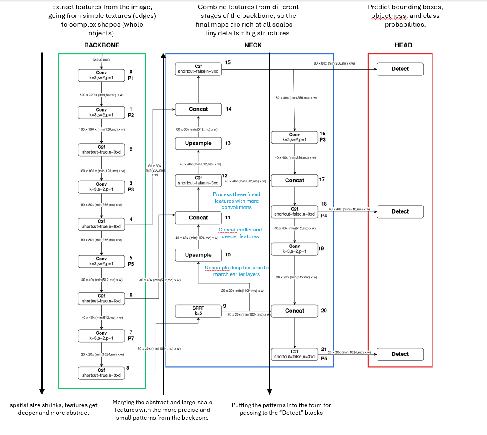

# YOLOv8 Architecture — 

This document briefly explains the key components and overall process of YOLOv8 object detection. It is intended for readers with limited prior knowledge of the model.



---

## 1. Backbone — Feature Extraction

The **Backbone** extracts multi-scale features from the input image, gradually reducing spatial size while increasing feature depth.

### Conv Block (Convolutional Block)
- Applies a 3x3 convolution.
- Uses stride 2 for downsampling or stride 1 to preserve spatial size.
- Followed by Batch Normalization and SiLU activation.

**Logical role:**
- Detects low-level patterns like edges and textures.
- Reduces spatial size when needed.

### C2f Block (Cross Stage Partial with Fusion)
- Splits input into two parts.
- One part skips directly to the output.
- The other part passes through several 3x3 convolutional layers.
- Final output is the concatenation of all features.

**Logical role:**
- Combines preserved low-level features with progressively refined features.

---

## 2. Neck — Feature Fusion

The **Neck** fuses features extracted at different backbone stages to detect objects at multiple scales.

### SPPF Block (Spatial Pyramid Pooling Fast)
- Applies three 5x5 max pooling layers with stride 1.
- Combines the original features with three pooled versions.

**Logical role:**
- Expands receptive field to capture local and global context.

### Upsample Block
- Doubles spatial size using nearest-neighbor interpolation.

**Logical role:**
- Matches deeper features to shallower feature map sizes.

### Concat Block
- Combines upsampled deep features with lateral features from the backbone.

**Logical role:**
- Fuses detailed and abstract features to detect objects at various sizes.

### C2f Block (within the Neck)
- Refines the fused features by combining skip and processed information.

---

## 3. Detection Head — Predicting Objects

The **detection head** predicts boxes, objectness, and class probabilities at three scales:
- Small objects (high-resolution grid)
- Medium objects (medium-resolution grid)
- Large objects (low-resolution grid)

### 1. Per-Cell Prediction
At each grid cell, the head predicts:

```
[x, y, w, h, objectness, class_1, class_2, ..., class_C]
```

Where:
- `x`, `y`: Box center offset within the cell (0 to 1).
- `w`, `h`: Box width and height relative to the image.
- `objectness`: Confidence score (probability object exists in cell).
- `class_i`: Probability for class `i`.

---

### 2. Convert to Absolute Coordinates

```
x_center = (col + x) * (image_width / grid_width)
y_center = (row + y) * (image_height / grid_height)
width = w * image_width
height = h * image_height
```

---

### 3. Anchor-Free Detection
- YOLOv8 uses **anchor-free detection**, meaning each cell predicts exactly one box directly (no predefined anchor boxes).

---

### 4. Post-Processing (NMS)

- **Confidence Thresholding**: Remove low-confidence boxes.
- **Non-Maximum Suppression (NMS)**: Remove overlapping boxes, keeping only the most confident one for each object.

---

### Final Output

The final list of detected objects is:

```
[x, y, width, height, confidence, class]
```

---

### Key Process Summary

1. **Backbone extracts features.**
2. **Neck fuses deep and shallow features.**
3. **Head predicts boxes, confidence, and classes at 3 scales.**
4. **NMS filters overlapping boxes.**
5. **Final list of objects is produced.**


